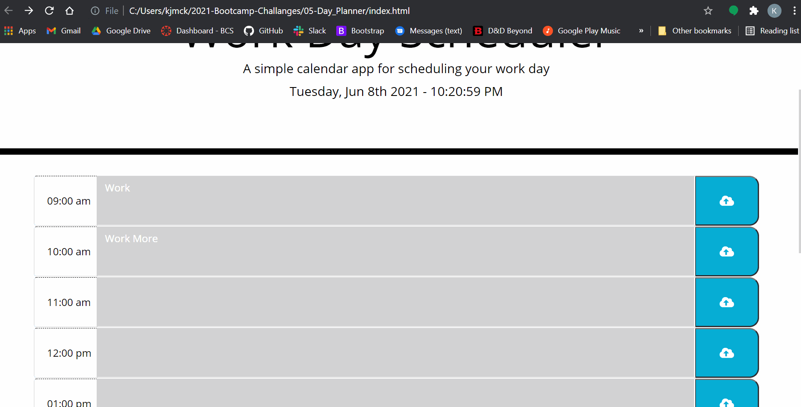

<!-- Work Day Scheduler -->

# Work Day Scheduler

## Description

This application is meant to serve as a simple day planner for the everyday user. When the user opens the application they see the current time and available time blocks for that time of day (hourly). the user can input information or appointments, then save the time slot into the local storage of their browser. If the user reloads the page, they should still see their saved information in the correct time-slot. 

## User Story

```
AS AN everyday human with a busy schedule
I WANT to add important and social events to a daily planner
SO THAT I can manage my time and fun effectively
```

## Criteria

```
GIVEN I am using a daily planner to create a schedule
WHEN I open the planner
THEN the current day is displayed at the top of the calendar
WHEN I scroll down
THEN I am presented with timeblocks for standard business hours
WHEN I view the timeblocks for that day
THEN each timeblock is color coded to indicate whether it is in the past, present, or future
WHEN I click into a timeblock
THEN I can enter an event
WHEN I click the save button for that timeblock
THEN the text for that event is saved in local storage
WHEN I refresh the page
THEN the saved events persist
```

## Screenshot Demo:

The Following gif Demonstrates This App's Functionality (will redo during the daytime to show colors):



## Resources

HTML |
CSS |
JavaScript |
JQuery |
moment.js |
Bootstrap

## Links

[Live Link](https://kjmckinley.github.io/day-planner/)

[GitHub Repo](https://github.com/kjmckinley/day-planner.git)

